# Kiérico UI

## #01 A base de um Design System

### #1.4 Criando pacote de tokens

**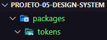**

#### Na pasta `tokens`:

- `npm init -y`

- `npm i -D typescript`

- `npx tsc --init`

    Se quiser `npx tsc`, para converter o código de TS para JS.

<br/><hr/><br/>

### #1.6 Build do pacote com TSUP

<!-- Agora vamos entender o que é o TSUP e como configurar ele para converter nosso código de TS para JS. -->

[TSUP](https://github.com/egoist/tsup)

#### Na pasta `tokens`:

- `npm i tsup -D`

**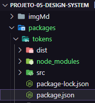**

```json
"scripts": {
    "build": "tsup src/index.ts --format esm,cjs --dts",
    "dev": "tsup src/index.ts --format esm,cjs --dts --watch"
  },
```

- `npm run build`

- `npm run dev`

<br/><hr/><br/>

### #1.7 Configurando Monorepo

**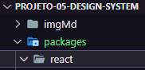**

#### Na pasta `react`:

- `npm init -y`

- `npm i typescript -D`

- `npm i tsup -D`

**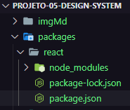**

```json
"name": "@kierico-ui/react",

"scripts": {
    "build": "tsup src/index.ts --format esm,cjs --dts",
    "dev": "tsup src/index.ts --format esm,cjs --dts --watch"
  },
```

- `npm run build`

#### Na raiz ( cd .. cd .. )

**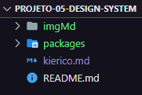**

- `npm init -y`

**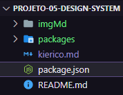**

apagar tudo e reescrever:

```json
{
  /** global/package-json */
  "private": true,
  "workspaces": [
      "packages/*"
  ]
}
```

***Excluir*** a pasta *`node_modules`* das pastas '**`react`**' e '**`tokens`**'.

***Excluir*** o arquivo *`package-lock.json`* das pastas '**`react`**' e '**`tokens`**'.

**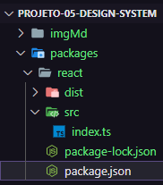**

```json
"devDependencies": {
  "@kierico-ui/tokens": "*", // <--
  "tsup": "^6.6.3",
  "typescript": "^4.9.5"
}
```

#### Na raiz:

**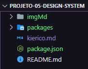**

- `npm i`

**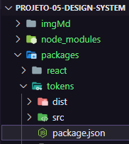**

```json
{
  "name": "@kierico-ui/tokens",
  "version": "1.0.0",
  "description": "",
  "main": "./dist/index.js", // <--
  "module": "./dist/index.mjs", // <--
  "types": "./dist/index.d.ts", // <--
  "scripts": { "..." }
}
```

**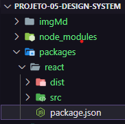**

```json
{
  "name": "@kierico-ui/react",
  "version": "1.0.0",
  "description": "",
  "main": "./dist/index.js", // <--
  "module": "./dist/index.mjs", // <--
  "types": "./dist/index.d.ts", // <--
  "scripts": {"..."}
}
```
#### Na raiz:

**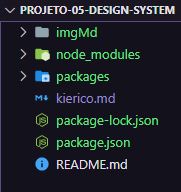**

- `npm i`

#### Na pasta `tokens`:

**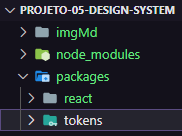**

- `npm run build`

> Se `npm run build` estiver dando erro, é só atualizar o 'NodeJS' para a versão LTS mais atual (v18.14.2 atual em 28/02/2023).

    OBS: Aqui pode está gerando algum erro, pois as tipagens do Typescript ainda vão ser configuradas.

<br/><hr/><br/>

### #1.7 Configuração do TypeScript

#### Na pasta `packages`:

Criar uma pasta '`ts-config`'.

**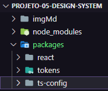**

- `npm init -y`

**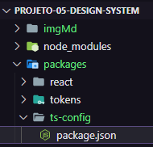**

```json
{
  /** package.json */
  "name": "@kierico-ui/ts-config",
  "version": "1.0.0",
  "license": "MIT",
  "private": true
}
```

#### Em '`packages/ts-config`', criar um arquivo `base.json`. Que é a configuração base do Typescript.

**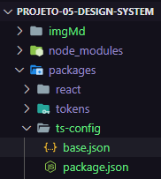**

```json
{
  /** base.json */
  "compilerOptions": {
    "composite": false,
    "declaration": true,
    "declarationMap": true,
    "esModuleInterop": true,
    "forceConsistentCasingInFileNames": true,
    "inlineSources": false,
    "isolatedModules": true,
    "moduleResolution": "node",
    "noUnusedLocals": false,
    "noUnusedParameters": false,
    "preserveWatchOutput": true,
    "skipLibCheck": true,
    "strict": true
  },
  "exclude": ["node_modules"]
}
```

#### E na mesma pasta '`packages/**`ts-config`**`', criar um arquivo `react.json`.

**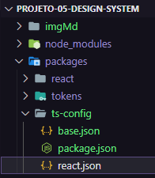**

```json
{
  /** react.json */
  "extends": "./base.json",
  "compilerOptions": {
      "jsx": "react-jsx",
      "lib": [
          "dom",
          "ES2015"
      ],
      "module": "ESNext",
      "target": "es6"
  }
}
```

#### E no arquivo `package-json` de '`react`' e '`tokens`':

**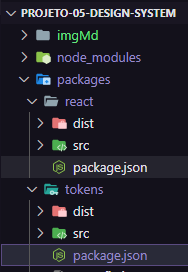**

```json
/** em ambos os arquivos add */
"devDependencies": {
  "@kierico-ui/ts-config": "*",
}
```

#### Na raiz:

**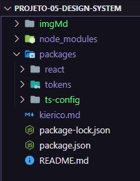**

- `npm i`

#### No arquivo `tsconfig-json` na pasta '`tokens`':

**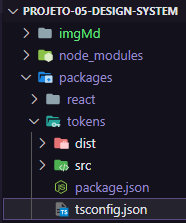**

```json
{
  /** tsconfig.json */
  "extends": "@kierico-ui/ts-config/base.json",
  "include": [
    "src"
  ],
  // "exclude": []
}
```

#### E fazer a mesma coisa para o pacote '`react`':

**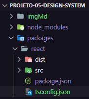**

```json
{
    "extends": "@kierico-ui/ts-config/react.json",
    "include": [
        "src"
    ],
    // "exclude": []
}
```

#### Na raiz:

****

- `npm i`

<br/><hr/><br/>

### #1.9 Configuração do ESLint

#### Na pasta `packages`, criar uma pasta `eslint-config`.

**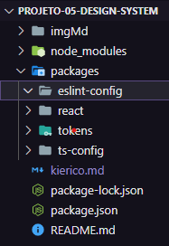**

- `npm init -y`

#### No '`package-json`':

**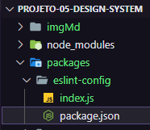**

```json
{
  /** eslint-config/package.json */
  "name": "@kierico-ui/eslint-config",
  "license": "MIT",
  "private": true,
  "main": "index.js"
}
```

#### Na pasta '`eslint-config`':

****

- `npm i -D eslint @rocketseat/eslint-config`

**`SE DER ERRO:`--->**

**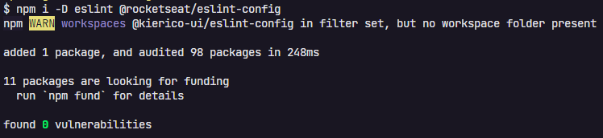**

**`TENTE DE NOVO SE DER ERRO!`<---**

#### No arquivo '`index.js`' na pasta '`eslint-config`':

**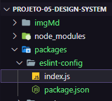**

```js
/** eslint-config/index.js */
module.exports = {
  extends: ["@rocketseat/eslint-config/react"]
}
```

#### No arquivo '`package.json`' nas pastas '`react`' e '`tokens`':

**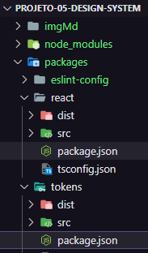**

```json
/** react/package.json & tokens/package.json*/
"devDependencies": {
  "@kierico-ui/tokens": "*",
  "@kierico-ui/ts-config": "*",
  "@kierico-ui/eslint-config": "*", // <--
  "tsup": "^6.6.3",
  "typescript": "^4.9.5"
}
```

#### Criar um arquivo `.eslintrc.json` nas pastas '`react`' e '`tokens`':

**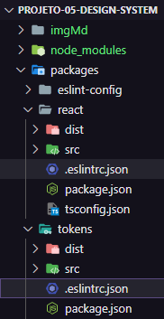**

```json
{
  /** react/eslintrc.json & tokens/eslintrc.json */
  "extends": "@kierico-ui/eslint-config"
}
```

#### Nos arquivos `package.json` das pastas '`react`' e '`tokens`':

**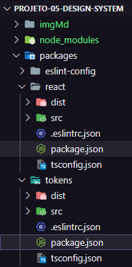**

```json
/** react/package.json & tokens/package.json*/
"scripts": {
    "build": "tsup src/index.ts --format esm,cjs --dts",
    "dev": "tsup src/index.ts --format esm,cjs --dts --watch",
    "lint": "eslint src/**/*.ts* --fix" // <--
  },
  ```
#### Nos pacotes '`tokens`' e '`react`', rodar:

**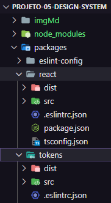**

- `npm run lint`.

      Warning: React version was set to "detect" in eslint-plugin-react settings, but the "react" package is not installed. Assuming latest React version for linting.
  
  > Tudo bem porque não temos o pacote React instalado!

<br/><hr/><hr/><br/>

## #02 Disign System em React

### #2.1 Configurando pacote do React

#### No pacote '`react`':

**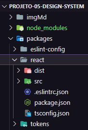**

- `npm i -D react @types/react @types/react-dom`

> OBS: Instalar o React em ambiente de desenvolvimento "-D", para não pesar e duplicar a aplicação.

#### No arquivo `package.json` do pacote 'react':

**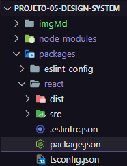**

**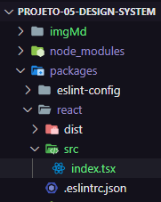**

`--external react` adicionar nos scripts: "build" e "dev", para importar o React da aplicação hospedeira.

E mudar as extensões do arquivo 'index.js' para '`index.tsx`' na pasta 'react', e no arquivo 'package.json' também.

```json
/** react/package.json */
"scripts": {
  "build": "tsup src/index.tsx --format esm,cjs --dts --external react", // <--
  "dev": "tsup src/index.tsx --format esm,cjs --dts --external react --watch", // <--
  "lint": "eslint src/**/*.ts* --fix"
},
```

#### No pacote '`react`' rodar:

****

- `npm run build`

> `Agora é só criar os componentes no 'react'.`

<br/><hr/><br/>

### #2.2 Configuração do Stitches

**[  ](https://stitches.dev/)**

#### No pacote '`react`':

****

- `npm i @stitches/react`

#### No pacote '`react`', na pasta '`src`' criar uma pasta '`styles`':

**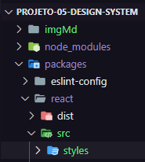**

#### Na pasta '`styles`' criar um arquivo '`index.ts`':

**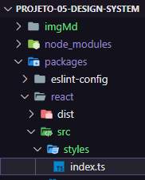**

```ts
/** react/src/styles/index.ts */
import {
  colors,
  fonts,
  fontSizes,
  fontWeights,
  lineHeights,
  radii,
  space,
} from '@kierico-ui/tokens'

import { createStitches, defaultThemeMap } from '@stitches/react'

export const {
  styled,
  css,
  globalCss,
  keyframes,
  getCssText,
  theme,
  createTheme,
  config,
} = createStitches({
  /** Mapear propriedades do CSS para algum tipo de Token */
  themeMap: {
    ...defaultThemeMap,
    width: 'space',
    height: 'space',
  },
  theme: {
    colors,
    fontSizes,
    fontWeights,
    fonts,
    lineHeights,
    radii,
    space,
  },
})
```

> Agora é só fazer a importação ( `import { styled } from './styles` ) para criar componentes.

### #2.3 Criandok app em Storybook

#### Na pasta '`packages`' criar uma pasta '`docs`':

#### Na pasta '`docs`':

- `npx sb init --builder @storybook/builder-vite --type react --use-npm`

Se der ERRO:

**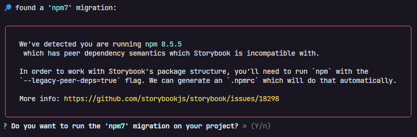**

  Se der o erro de cima, fazer downgrade:

  - [NodeJS](https://nodejs.org/en/download/releases/) para a versão 16.15.0

  - NPM para a versão 8.5.5 `npm install -g npm@8.5.5`

  Se ao rodar `npx sb init --builder @storybook/builder-vite --type react --use-npm` não instalar todas as 'devDependencies', excluir a pasta '`docs`' e rodar novamente `npx sb init --builder @storybook/builder-vite --type react --use-npm`.

#### Ainda no pacote '`docs`':

- `npm i vite @vitejs/plugin-react -D`

Na pasta '`docs`' criar um arquivo `vite.config.js`:

```js
/** docs/vite.config.js */

/// <reference types="vite/client" />

import { defineConfig } from 'vite'
import react from '@vitejs/plugin-react'

export default defineConfig({
  plugins: [react()]
})
```

Ainda no pacote '`docs`':

- `npm i react react-dom`

No arquivo '`package.json`' do pacote '`docs`':

```json
/** docs/package.json */
{
  "name": "@kierico-ui/docs", // <--
  "version": "1.0.0",
  "description": "",
  "main": "index.js",
  "scripts": {
    "test": "echo \"Error: no test specified\" && exit 1",
    "dev": "start-storybook -p 6006", // <-- alterar para 'dev'
    "build": "build-storybook" // <-- alterar para 'build'
  },
  "keywords": [],
  "author": "",
  "license": "MIT", // <-- ISC
  "devDependencies": {
    "@vitejs/plugin-react": "^3.1.0",
    "vite": "^4.1.4"
  },
  "dependencies": {
    "react": "^18.2.0",
    "react-dom": "^18.2.0"
  }
}
```

#### No pacote '`docs`':

- `npm run dev`

  Se der ERRO, excluir a pasta '`node_modules`' das pastas '`docs`' e '`raiz`', e rodar `npm i` na pasta '`docs`'.

- Se der erro no Storybook, rodar '`npm i`' na raiz.

    > Lembrando que não podemos instalar o Storybook dentro de pasta que tenha o nome com caracteres especiais.

