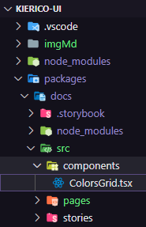

# Kiérico UI

## #01 A base de um Design System

### #1.4 Criando pacote de tokens

****

#### Na pasta `tokens`:

- `npm init -y`

- `npm i -D typescript`

- `npx tsc --init`

    Se quiser `npx tsc`, para converter o código de TS para JS.

<br/><hr/><br/>

### #1.6 Build do pacote com TSUP

<!-- Agora vamos entender o que é o TSUP e como configurar ele para converter nosso código de TS para JS. -->

[TSUP](https://github.com/egoist/tsup)

#### Na pasta `tokens`:

- `npm i tsup -D`

****

```json
"scripts": {
    "build": "tsup src/index.ts --format esm,cjs --dts",
    "dev": "tsup src/index.ts --format esm,cjs --dts --watch"
  },
```

- `npm run build`

- `npm run dev`

<br/><hr/><br/>

### #1.7 Configurando Monorepo

****

#### Na pasta `react`:

- `npm init -y`

- `npm i typescript -D`

- `npm i tsup -D`

****

```json
"name": "@kierico-ui/react",

"scripts": {
    "build": "tsup src/index.ts --format esm,cjs --dts",
    "dev": "tsup src/index.ts --format esm,cjs --dts --watch"
  },
```

- `npm run build`

#### Na raiz ( cd .. cd .. )

****

- `npm init -y`

****

apagar tudo e reescrever:

```json
{
  /** global/package-json */
  "private": true,
  "workspaces": [
      "packages/*"
  ]
}
```

***Excluir*** a pasta *`node_modules`* das pastas '**`react`**' e '**`tokens`**'.

***Excluir*** o arquivo *`package-lock.json`* das pastas '**`react`**' e '**`tokens`**'.

****

```json
"devDependencies": {
  "@kierico-ui/tokens": "*", // <--
  "tsup": "^6.6.3",
  "typescript": "^4.9.5"
}
```

#### Na raiz:

****

- `npm i`

****

```json
{
  "name": "@kierico-ui/tokens",
  "version": "1.0.0",
  "description": "",
  "main": "./dist/index.js", // <--
  "module": "./dist/index.mjs", // <--
  "types": "./dist/index.d.ts", // <--
  "scripts": { "..." }
}
```

****

```json
{
  "name": "@kierico-ui/react",
  "version": "1.0.0",
  "description": "",
  "main": "./dist/index.js", // <--
  "module": "./dist/index.mjs", // <--
  "types": "./dist/index.d.ts", // <--
  "scripts": {"..."}
}
```
#### Na raiz:

****

- `npm i`

#### Na pasta `tokens`:

****

- `npm run build`

> Se `npm run build` estiver dando erro, é só atualizar o 'NodeJS' para a versão LTS mais atual (v18.14.2 atual em 28/02/2023).

    OBS: Aqui pode está gerando algum erro, pois as tipagens do Typescript ainda vão ser configuradas.

<br/><hr/><br/>

### #1.7 Configuração do TypeScript

#### Na pasta `packages`:

Criar uma pasta '`ts-config`'.

****

- `npm init -y`

****

```json
{
  /** package.json */
  "name": "@kierico-ui/ts-config",
  "version": "1.0.0",
  "license": "MIT",
  "private": true
}
```

#### Em '`packages/ts-config`', criar um arquivo `base.json`. Que é a configuração base do Typescript.

****

```json
{
  /** base.json */
  "compilerOptions": {
    "composite": false,
    "declaration": true,
    "declarationMap": true,
    "esModuleInterop": true,
    "forceConsistentCasingInFileNames": true,
    "inlineSources": false,
    "isolatedModules": true,
    "moduleResolution": "node",
    "noUnusedLocals": false,
    "noUnusedParameters": false,
    "preserveWatchOutput": true,
    "skipLibCheck": true,
    "strict": true
  },
  "exclude": ["node_modules"]
}
```

#### E na mesma pasta '`packages/ts-config`', criar um arquivo `react.json`.

****

```json
{
  /** react.json */
  "extends": "./base.json",
  "compilerOptions": {
      "jsx": "react-jsx",
      "lib": [
          "dom",
          "ES2015"
      ],
      "module": "ESNext",
      "target": "es6"
  }
}
```

#### E no arquivo `package-json` de '`react`' e '`tokens`':

****

```json
/** em ambos os arquivos add */
"devDependencies": {
  "@kierico-ui/ts-config": "*",
}
```

#### Na raiz:

****

- `npm i`

#### No arquivo `tsconfig-json` na pasta '`tokens`':

****

```json
{
  /** tsconfig.json */
  "extends": "@kierico-ui/ts-config/base.json",
  "include": [
    "src"
  ],
  // "exclude": []
}
```

#### E fazer a mesma coisa para o pacote '`react`':

****

```json
{
    "extends": "@kierico-ui/ts-config/react.json",
    "include": [
        "src"
    ],
    // "exclude": []
}
```

#### Na raiz:

****

- `npm i`

<br/><hr/><br/>

### #1.9 Configuração do ESLint

#### Na pasta `packages`, criar uma pasta `eslint-config`.

****

- `npm init -y`

#### No '`package-json`':

****

```json
{
  /** eslint-config/package.json */
  "name": "@kierico-ui/eslint-config",
  "license": "MIT",
  "private": true,
  "main": "index.js"
}
```

#### Na pasta '`eslint-config`':

****

- `npm i -D eslint @rocketseat/eslint-config`

**`SE DER ERRO:`--->**

****

**`TENTE DE NOVO SE DER ERRO!`<---**

#### No arquivo '`index.js`' na pasta '`eslint-config`':

****

```js
/** eslint-config/index.js */
module.exports = {
  extends: ["@rocketseat/eslint-config/react"]
}
```

#### No arquivo '`package.json`' nas pastas '`react`' e '`tokens`':

****

```json
/** react/package.json & tokens/package.json*/
"devDependencies": {
  "@kierico-ui/tokens": "*",
  "@kierico-ui/ts-config": "*",
  "@kierico-ui/eslint-config": "*", // <--
  "tsup": "^6.6.3",
  "typescript": "^4.9.5"
}
```

#### Criar um arquivo `.eslintrc.json` nas pastas '`react`' e '`tokens`':

****

```json
{
  /** react/eslintrc.json & tokens/eslintrc.json */
  "extends": "@kierico-ui/eslint-config"
}
```

#### Nos arquivos `package.json` das pastas '`react`' e '`tokens`':

****

```json
/** react/package.json & tokens/package.json*/
"scripts": {
    "build": "tsup src/index.ts --format esm,cjs --dts",
    "dev": "tsup src/index.ts --format esm,cjs --dts --watch",
    "lint": "eslint src/**/*.ts* --fix" // <--
  },
  ```
#### Nos pacotes '`tokens`' e '`react`', rodar:

****

- `npm run lint`.

      Warning: React version was set to "detect" in eslint-plugin-react settings, but the "react" package is not installed. Assuming latest React version for linting.
  
  > Tudo bem porque não temos o pacote React instalado!

<br/><hr/><hr/><br/>

## #02 Disign System em React

### #2.1 Configurando pacote do React

#### No pacote '`react`':

****

- `npm i -D react @types/react @types/react-dom`

> OBS: Instalar o React em ambiente de desenvolvimento "-D", para não pesar e duplicar a aplicação.

#### No arquivo `package.json` do pacote 'react':

****

****

`--external react` adicionar nos scripts: "build" e "dev", para importar o React da aplicação hospedeira.

E mudar as extensões do arquivo 'index.js' para '`index.tsx`' na pasta 'react', e no arquivo 'package.json' também.

```json
/** react/package.json */
"scripts": {
  "build": "tsup src/index.tsx --format esm,cjs --dts --external react", // <--
  "dev": "tsup src/index.tsx --format esm,cjs --dts --external react --watch", // <--
  "lint": "eslint src/**/*.ts* --fix"
},
```

#### No pacote '`react`' rodar:

****

- `npm run build`

> `Agora é só criar os componentes no 'react'.`

<br/><hr/><br/>

### #2.2 Configuração do Stitches

**[  ](https://stitches.dev/)**

#### No pacote '`react`':

****

- `npm i @stitches/react`

#### No pacote '`react`', na pasta '`src`' criar uma pasta '`styles`':

****

#### Na pasta '`styles`' criar um arquivo '`index.ts`':

****

```ts
/** react/src/styles/index.ts */
import {
  colors,
  fonts,
  fontSizes,
  fontWeights,
  lineHeights,
  radii,
  space,
} from '@kierico-ui/tokens'

import { createStitches, defaultThemeMap } from '@stitches/react'

export const {
  styled,
  css,
  globalCss,
  keyframes,
  getCssText,
  theme,
  createTheme,
  config,
} = createStitches({
  /** Mapear propriedades do CSS para algum tipo de Token */
  themeMap: {
    ...defaultThemeMap,
    width: 'space',
    height: 'space',
  },
  theme: {
    colors,
    fontSizes,
    fontWeights,
    fonts,
    lineHeights,
    radii,
    space,
  },
})
```

> Agora é só fazer a importação ( `import { styled } from './styles'` ) para criar componentes.

<br/><hr/><br/>

### #2.3 Criandok app em Storybook

#### Na pasta '`packages`' criar uma pasta '`docs`':

#### Na pasta '`docs`':

- `npx sb init --builder @storybook/builder-vite --type react --use-npm`

Se der ERRO:

****

  Se der o erro de cima, fazer downgrade:

  - [NodeJS](https://nodejs.org/en/download/releases/) para a versão 16.15.0

  - NPM para a versão 8.5.5 `npm install -g npm@8.5.5`

  Se ao rodar `npx sb init --builder @storybook/builder-vite --type react --use-npm` não instalar todas as 'devDependencies', excluir a pasta '`docs`' e rodar novamente `npx sb init --builder @storybook/builder-vite --type react --use-npm`.

#### Ainda no pacote '`docs`':

- `npm i vite @vitejs/plugin-react -D`

Na pasta '`docs`' criar um arquivo `vite.config.js`:

```js
/** docs/vite.config.js */

/// <reference types="vite/client" />

import { defineConfig } from 'vite'
import react from '@vitejs/plugin-react'

export default defineConfig({
  plugins: [react()]
})
```

Ainda no pacote '`docs`':

- `npm i react react-dom`

No arquivo '`package.json`' do pacote '`docs`':

```json
/** docs/package.json */
{
  "name": "@kierico-ui/docs", // <--
  "version": "1.0.0",
  "description": "",
  "main": "index.js",
  "scripts": {
    "test": "echo \"Error: no test specified\" && exit 1",
    "dev": "start-storybook -p 6006", // <-- alterar para 'dev'
    "build": "build-storybook" // <-- alterar para 'build'
  },
  "keywords": [],
  "author": "",
  "license": "MIT", // <-- ISC
  "devDependencies": {
    "@vitejs/plugin-react": "^3.1.0",
    "vite": "^4.1.4"
  },
  "dependencies": {
    "react": "^18.2.0",
    "react-dom": "^18.2.0"
  }
}
```

#### No pacote '`docs`':

- `npm run dev`

  Se der ERRO, excluir a pasta '`node_modules`' das pastas '`docs`' e '`raiz`', e rodar `npm i` na pasta '`docs`'.

- Se der erro no Storybook, rodar '`npm i`' na raiz.

  - E se precisar, excluir a pasta '`dist`' dos pacotes '`react`' e '`tokens`', e rodar `npm run dev` nos pacotes `react`e `tokens`.

    > Lembrando que não podemos instalar o Storybook dentro de pasta que tenha o nome com caracteres especiais.

<br/><hr/><br/>

### #2.4 Story: Button

#### Na pasta '`docs`', criar uma pasta '`src`' e dentro uma pasta '`stories`':

****

E dentro é só criar as Stories (documentação).

  > Lembrando que as '`stories`' sempre vão ter a extensão `stories.tsx`. Ex: "Button.stories.tsx".


#### Em '`docs`', na pasta '`.storybook`' e no arquivo '`main.js`':

****

Adicionar `/src/`:

```js
/** docs/.storybook/main.js */
module.exports = {
  "stories": [
    "../src/stories/**/*.stories.mdx", // <-- add /src/
    "../src/stories/**/*.stories.tsx" // <-- add /src/ & /*.stories.@(js|jsx|ts|tsx)
  ],
  "addons": [
    "@storybook/addon-links",
    "@storybook/addon-essentials",
    "@storybook/addon-interactions"
  ],
  "framework": "@storybook/react",
  "core": {
    "builder": "@storybook/builder-vite"
  },
  "features": {
    "storyStoreV7": true
  }
}
```

#### Na pasta '`docs`', no arquivo '`package.json`':

****

```json
/** docs/package.json */
"dependencies": {
  "@kierico-ui/react": "*", // <--
  "@kierico-ui/tokens": "*", // <--
  "@kierico-ui/eslint-config": "*", // <--
  "react": "^18.2.0",
  "react-dom": "^18.2.0"
}
```

ainda na pasta '`docs`':

- `npm i`

ainda em '`docs`' criar um arquivo '`.eslintrc.json`'.

****

```json
/** docs/.eslintrc.json */
{
    "extends": "@kierico-ui/eslint-config"
}
```

Agora, no stories 'Button.stories.tsx' é só importar os 'componentes' de 'react'.
  
  ex:
  
  ```tsx
  import { Button } from '@kierico-ui/react`
  ```

Para criar a primeira story, importar:

  ```tsx
  import type { StoryObj, Meta } from '@storybook/react'
  ```

<br/><hr/><br/>

### #2.5 Tema Dark no Storybook

#### Na pasta '`.storybook`' em '`docs`', criar um arquivo `manager.js`:

****

```js
/** docs/.storybook/manager.js */
import { addons } from '@storybook/addons'
import { themes } from '@storybook/theming'

addons.setConfig({
  theme: themes.dark
})
```

Na pasta '`docs`':

  Agora é só encerrar o storybook

  - `Ctrl + C`
  
  por para rodar novamente.

  - `npm run dev`

<br/><hr/><br/>

### #2.6 Adicionando fonte externa

#### No arquivo '`preview-head.html`', na pasta '`.storybook`' de '`docs`':

****

```html
<!-- docs/.storybook/preview-head.html -->
<link rel="preconnect" href="https://fonts.googleapis.com" /> <!--// <-- -->
<link rel="preconnect" href="https://fonts.gstatic.com" crossorigin /> <!--// <-- -->
<link href="https://fonts.googleapis.com/css2?family=Roboto:wght@400;500;700&display=swap" rel="stylesheet" /> <!--// <-- -->

<script>
  window.global = window;
</script>

```

<br/><hr/><br/>

### #2.7 Documentação de cores

#### Criar a pasta `pages` na pasta '`src`' de '`docs`':

****

#### e no arquivo '`main.js`' na pasta '`.storybook`' de '`docs`', mudar a rota de 'stories' para 'pages'.

```js
module.exports = {
  "stories": [
    "../src/pages/**/*.stories.mdx", // <--
    "../src/stories/**/*.stories.tsx"
  ],
  "addons": [
    "@storybook/addon-links",
    "@storybook/addon-essentials",
    "@storybook/addon-interactions"
  ],
  "framework": "@storybook/react",
  "core": {
    "builder": "@storybook/builder-vite"
  },
  "features": {
    "storyStoreV7": true
  }
}
```

  - Em '`docs`', parar o Storybook (`Ctrl + C`) e rodar novamente `npm run dev`.

[ Storybook MDX ](https://storybook.js.org/docs/react/api/mdx)

E dentro da pasta '`pages`' criar o arquivo `home.stories.mdx`.

****

```jsx
/** docs/src/pages/home.stories.mdx */
import { Meta } from '@storybook/addon-docs'

<Meta title="Home" />

# Kiérico UI

My Design System
```

#### Para adicionar o tema Dark na aba Canvas do Storybook

#### No arquivo '`preview.js`' na pasta '`.storybook`' de '`docs`':

****

```js
/** docs/.storybook/preview.js */
/* importação para adionar o tema dark na página do canvas */
import { themes } from '@storybook/theming' // <--

export const parameters = {
  actions: { argTypesRegex: "^on[A-Z].*" },
  controls: {
    matchers: {
      color: /(background|color)$/i,
      date: /Date$/,
    },
  },

  /** theme dark */
  docs: { // <--
    theme: themes.dark, // <--
  }
}
```

Se não carregar (alterar) a fonte e a cor, no arquivo '`package.json`' do pacote '`docs`', adicionar nas 'devDependencies':

```json
"devDependencies": {
    "@storybook/builder-vite": "^0.3.0", // <-- ("^0.4.2" versão que tava)
  },
```

e no pacote '`docs`' rodar:

  - `npm i`

<br />

#### Em '`pages`', na pasta '`src`' da pasta '`docs`', criar uma pasta `tokens`:

****

  E na pasta '`tokens`' de '`pages`' na pasta '`src`' de '`docs`', criar um arquivo `colors.stories.mdx`.

****

```jsx
/** docs/src/pages/tokens/colors.stories.mdx */
import { Meta } from '@storybook/addon-docs'

<Meta title="Tokens/Colors" />

# Colors

Essas são as cores utilizadas no Kiérico UI.
```

#### Em '`src`' da pasta '`docs`', criar uma pasta '`components`'. E dentro da pasta '`components`' em '`src`' de '`docs`', criar um arquivo `ColorsGrid.tsx`.

****

```tsx
/** docs/src/components/ColorsGrid.tsx */
import { colors } from '@kierico-ui/tokens'

export function ColorsGrid() {
  return Object.entries(colors).map(([key, color]) => {
    return (
      <div key={key} style={{ backgroundColor: color, padding: '2rem' }}>
        <div
          style={{
            display: 'flex',
            justifyContent: 'space-between',
            fontFamily: 'monospace',
            color: '#fff',
          }}
        >
          {/** $ para saber que isso é um token */}
          <strong>${key}</strong>
          <span>{color}</span>
        </div>
      </div>
    )
  })
}
```

E no arquivo `colors.stories.mdx` na pasta '`tokens`' em '`pages`' na pasta '`src`' da pasta '`docs`', adicionar:

****

```jsx
import { Meta } from '@storybook/addon-docs'
import {ColorsGrid} from '../../components/ColorsGrid' // <--

<Meta title="Tokens/Colors" />

# Colors

Essas são as cores utilizadas no Kiérico UI.

<ColorsGrid /> // <--
```

No pacote '`docs`':

- `npm i polished`

> Polished, fazer calculos de cores.

No arquivo '`ColorsGrid.tsx`' na pasta '`components`' em '`src`' da pasta '`docs`', importar o 'polished' e fazer o calculo de cores.

****

```tsx
import { colors } from '@kierico-ui/tokens'
import { getContrast } from 'polished' // <--

export function ColorsGrid() {
  return Object.entries(colors).map(([key, color]) => {
    return (
      <div key={key} style={{ backgroundColor: color, padding: '2rem' }}>
        <div
          style={{
            display: 'flex',
            justifyContent: 'space-between',
            fontFamily: 'monospace',
            /** calculo de cores com o Polished */
            color: getContrast(color, '#fff') < 3.5 ? '#000' : '#fff', // <--
          }}
        >
          <strong>${key}</strong>
          <span>{color}</span>
        </div>
      </div>
    )
  })
}
```

Para corrigir erro de Typescript no arquivo 'ColorsGrid.tsx', no arquivo '`package.json`' no pacote '`docs`', adicionar:

****

```json
/** docs/package.json */
"dependencies": {
  "@kierico-ui/eslint-config": "*",
  "@kierico-ui/ts-config": "*", // <--
  "@kierico-ui/react": "*",
  "@kierico-ui/tokens": "*",
  "polished": "^4.2.2",
  "react": "^18.2.0",
  "react-dom": "^18.2.0"
}
```

e no pacote '`docs`' rodar:

  - `npm i`

e ainda no pacote '`docs`', criar um arquivo `tsconfig.json`:

```json
/** docs/tsconfig.json */
{
  "extends": "@kierico-ui/ts-config/react.json",
  "include": [
      "src"
  ],
  // "exclude": []
}
```

<br/><hr/><br/>

### #2.9 Configurando TurboRepo

#### Na raiz:

 - `git init`

e criar um arquivo `.gitignore` na raiz:

```ts
/** .gitignore da raiz */
node_modules
dist
.turbo
```

na pasta '`docs`' para gerar a pasta `storybook-static`:

  - `npm run build`

e também criar um arquivo `.gitignore` na pasta '`docs`':

```ts
/** .gitignore da raiz */
storybook-static
```

#### Na raiz rodar:

  - `npm i turbo@latest -D`

e ainda na raiz criar um arquivo `turbo.json`.

```json
{
  /* schema para o JSON ficar inteligente (autocomplete) */
  "$schema": "https://turborepo.org/schema.json",
  "pipeline": {
    "dev": {
      "cache": false
    },
    "build": {
      "outputs": [
        "dist/**",
        "storybook-static/**"
      ],
      "dependsOn": [
        "^build"
      ]
    }
  }
}
```

e no arquivo arquivo '`package.json`' da raiz, adicionar os 'scripts':

```json
/** package.json da raiz */
{
  "private": true,
  "workspaces": [
    "packages/*"
  ],
  /** os scripts de 'dev' execultem em paralelo (juntos). */
  "scripts": {                          // <---
    "dev": "turbo run dev --parallel",  // <---
    "build": "turbo run build"          // <---
  },
  "devDependencies": {
    "turbo": "^1.8.5"
  }
}
```

Na raiz, para rodar todos os scripts 'dev', execulte:

  - `npm run build`

  - `npm run dev`

<br/><hr/><br/>

## #3 Componentes do Design System

  - `npm run dev`

### #3.3 Componente: Heading

Se estiver dando erro na importação:

  - limpar o cache, excluindo as pastas 'dist' e a pasta 'storybook' que esta dentro da pasta 'cache' que esta dentro da pasta 'node_module' da pasta 'docs'.

- `npm i`

- `npm run dev`

- no VSCode `Ctrl + P` e roda `>reload windows` || TypeScript: Restart TS server.

### #3.4 - Componente: Avatar

[Radix](https://www.radix-ui.com/docs/primitives/components/avatar)

#### No pacote '`react`' instalar:

  - `npm install @radix-ui/react-avatar`

  - `npm i phosphor-react`

### #3.5 - Componente: Button

#### No pacote '`docs`' instalar:

- `npm i phosphor-react`

### #3.7 - Componente: TextArea

#### Se der erro de importação '@kierico-ui/react', é só parar o terminal (Ctrl + C) e rodar 'npm run dev' novamente.

### #3.8 - Componente: Checkbox

[Radix](https://www.radix-ui.com/docs/primitives/components/avatar)

  - `npm install @radix-ui/react-checkbox`

<br/><hr/><br/>

## #4 Melhorias no Storybook

### #4.3 Controles nos componentes

[ArgTypes](https://storybook.js.org/docs/react/api/argtypes)

### #4.4 Addon de acessibilidade

[storybook-addon-a11y](https://storybook.js.org/addons/@storybook/addon-a11y)

No pacote '`docs`':

  - `npm install @storybook/addon-a11y`

E, adiciona, no arquivo '`main.js`', na pasta '`.storybook`' da pasta '`docs`':

```js
/** docs/.storybook/main.js */
module.exports = {
  "stories": [
    "../src/pages/**/*.stories.mdx",
    "../src/stories/**/*.stories.tsx"
  ],
  "addons": [
    "@storybook/addon-links",
    "@storybook/addon-essentials",
    "@storybook/addon-interactions",
    "@storybook/addon-a11y" // <---
  ],
  "framework": "@storybook/react",
  "core": {
    "builder": "@storybook/builder-vite"
  },
  "features": {
    "storyStoreV7": true
  }
}
```

Parar o server `Ctrl + C` e rodar novamente `npm run dev`.

<br/><hr/><br/>

## #5 Publicação e Manutenção

### #5.1 Publicando Storybook

[Storybook Deployer](https://github.com/storybook-eol/storybook-deployer)

No pacote '`docs`', instalar:

  - `npm i @storybook/storybook-deployer --save-dev`

No arquivo '`package.json`' da pasta `docs`, adicionar no "scripts":

```json
/** docs/package.json */
{
  "name": "@kierico-ui/docs",
  "version": "1.0.0",
  "description": "",
  "main": "index.js",
  "scripts": {
    "test": "echo \"Error: no test specified\" && exit 1",
    "dev": "start-storybook -p 6006",
    "deploy-storybook": "storybook-to-ghpages", // <---
    "build": "build-storybook"
  },
  ...
}
```

#### Criar uma pasta '`.github`' na raiz, detro dela criar outra pasta '`workflows`' e dentro de 'workflows' um arquivo '`deploy-docs.yml`'.

[Actions Checkout V3](https://github.com/actions/checkout)

```yml
# .github/workflows/deploy-docs.yml
name: Deploy docs

on: 
  push:
    branches: 
      - main

jobs: 
  build-and-deploy:
    runs-on: ubuntu-latest
    steps: 
      - name: Checkout
        uses: actions/checkout@v3
      
      - name: Setup Node.js
        uses: actions/setup-node@v3
        with: 
          node-version: 16
      
      - run: npm ci

      - run: npm run build # configuração do turbo repo.

      - name: Deploy storybook
        working-directory: ./packages/docs # entrar na pasta packages/docs.
        run: npm run deploy-storybook -- --ci --existing-output-dir=storybook-static # pasta que vai ter o projeto.
        env: 
          GH_TOKEN: ${{ github.actor }}:${{ secrets.GITHUB_TOKEN }}

```

Fazer um commit: `ci: Add docs workflow` na branch '`main`'.

OBS: se der erro, na 'run workflow' da action do github, tera que marcar a opção da imagem abaixo, que estara em 'Settings/General/Workflow permissions'

****

[TurboRepo Remote Caching](https://turbo.build/repo/docs/core-concepts/remote-caching)

#### No arquivo `main.js` da pasta `.storybook` na pasta `docs`, add:

```js
/** docs/.storybook/main.js */
module.exports = {
  "stories": [
    "../src/pages/**/*.stories.mdx",
    "../src/stories/**/*.stories.tsx"
  ],
  "addons": [
    "@storybook/addon-links",
    "@storybook/addon-essentials",
    "@storybook/addon-interactions",
    "@storybook/addon-a11y"
  ],
  "framework": "@storybook/react",
  "core": {
    "builder": "@storybook/builder-vite"
  },
  "features": {
    "storyStoreV7": true
  },
  viteFinal: (config, { configType }) => { // <---
    if (configType === 'PRODUCTION') {     // <---
      config.base = 'kierico-ui'           // <---
    }                                      // <---
    return config                          // <---
  }
}
```

```js
/**
Commits válidos da aula 5.1 - Publicando Storybook:
  - ci: Add docs workflow - update    <e3cd265>
  - fix: Add subpath to Storybook on production    <dada9bf>
*/

```

### #5.2 Configurando Changesets

[TurboRepo: Publishing Packages - Versioning and Publishing](https://turbo.build/repo/docs/handbook/publishing-packages/versioning-and-publishing)

[@changesets/cli 🦋](https://github.com/changesets/changesets/blob/main/packages/cli/README.md)

#### Na raiz, install:

  - `npm i @changesets/cli -D`

  rodar:

  - `npx changeset init`

Add no arquivo `config.json` da pasta `.changeset` que esta na raiz, alterar o access:

```json
/** Na raiz: .changeset/config.json */
{
  "$schema": "https://unpkg.com/@changesets/config@2.3.0/schema.json",
  "changelog": "@changesets/cli/changelog",
  "commit": false,
  "fixed": [],
  "linked": [],
  "access": "public", // <---
  "baseBranch": "main",
  "updateInternalDependencies": "patch",
  "ignore": ["@kierico-ui/docs"] // pacote que não vai ser publicado no 'npm', e não monitorado pelo 'changeset'.
}

```

E no arquivo `package.json` da raiz, adicionar em 'scripts':

```json
/** package.json da raiz */
{
  "private": true,
  "workspaces": [
    "packages/*"
  ],
  "scripts": {
    "dev": "turbo run dev --parallel",
    "build": "turbo run build",
    "changeset": "changeset",    // <---
    "version-packages": "changeset version",    // <---
    /** O sinal '!' na frente de 'docs' é para evitar rodar a build no pacote 'docs'. */
    "release": "turbo run build --filter=!docs && changeset publish"    // <---
  },
  "devDependencies": {
    "@changesets/cli": "^2.26.1",
    "turbo": "^1.8.5"
  }
}
```

Criar uma conta no NPM, e criar uma organização (kierico-ui "esse nome é único").

No arquivo `package.json` da pasta `eslint-config`, add a 'version': 

```json
/** eslint-config/package.json */
{
  "name": "@kierico-ui/eslint-config",
  "version": "1.0.0",    // <---
  "license": "MIT",
  "private": true,
  "main": "index.js",
  "devDependencies": {
    "@rocketseat/eslint-config": "^1.2.0",
    "eslint": "^8.35.0"
  }
}
```

  rodar:

    - `npm run changeset` , comdando rodado por qualquer pessoa que esta mantendo (fazendo alterações) o repositório.

****

****

****

****

  - `npm run version-packages`

Publicar o pacote:

  - `npm run release`

### #5.3 Cache na Github Actions

[Vercel: Monorepos/Remote Caching/Use Remore Caching from CI/CD](https://vercel.com/docs/concepts/monorepos/remote-caching#use-remote-caching-from-external-ci/cd)

Criar um 'token'.

No arquivo `deploy-docs.yml`, add:

```yml
# .github/workflows/deploy-docs.yml
name: Deploy docs

on: 
  push:
    branches: 
      - main

jobs: 
  build-and-deploy:
    runs-on: ubuntu-latest
    steps: 
      - name: Checkout
        uses: actions/checkout@v3
      
      - name: Setup Node.js
        uses: actions/setup-node@v3
        with: 
          node-version: 16
          cache: 'npm'    # <---
          cache-dependency-path: '**/package-lock.json'    # <---
      
      - run: npm ci

      - run: npm run build
        env: 
          TURBO_TOKEN: ${{ secrets.VERCEL_TOKEN }}    # <---
          TURBO_TEAM: kierico    # <---

      - name: Deploy storybook
        working-directory: ./packages/docs
        run: npm run deploy-storybook -- --ci --existing-output-dir=storybook-static
        env: 
          GH_TOKEN: ${{ github.actor }}:${{ secrets.GITHUB_TOKEN }}
```

Agora é só publicar fazendo um 'commit' no github.

  "ci: Add TurboRepo cache on deploy build", "ci: Add NPM cache" ou "ci: Use secret as vercel token".

### Teste de commit